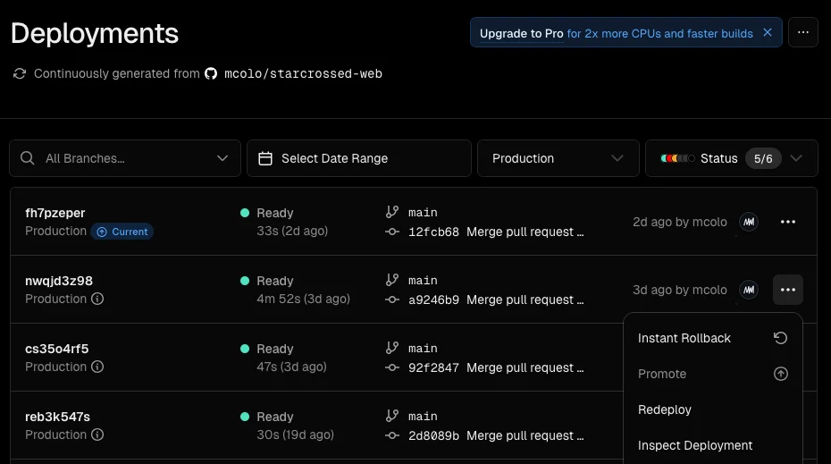
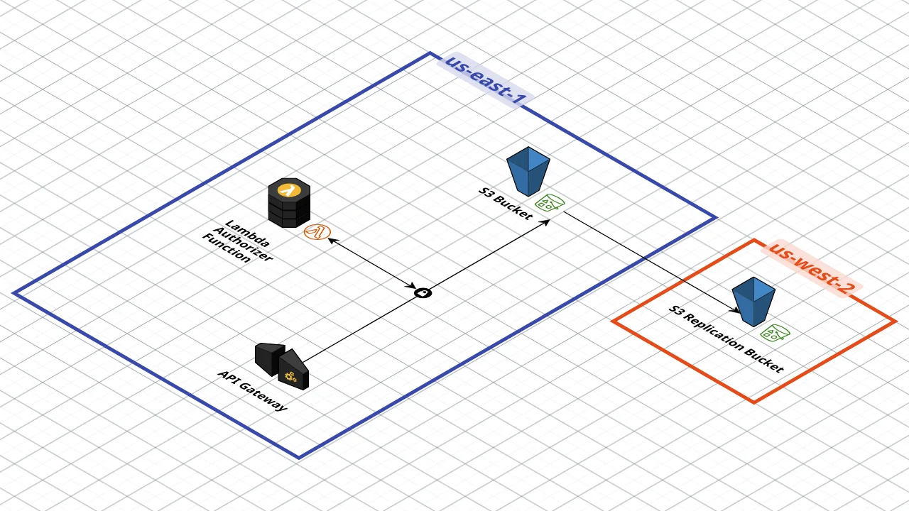
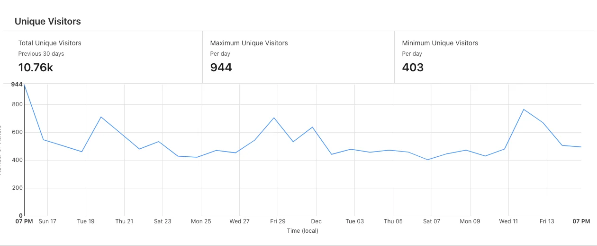
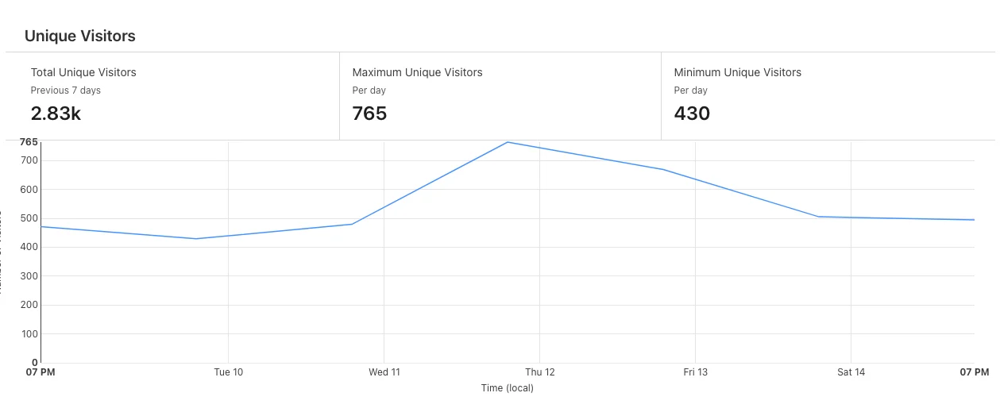

I've been building a daily movie puzzle game called [starcrossed](https://starcrossed.today), and I've managed to set it up and maintain it at essentially no cost. We're currently seeing about 500 daily users and growing. While things might change if traffic were to surge exponentially, it's been cool to see how affordable creating and maintaining a project like this can be.

As a software engineer today, it's easy to feel overwhelmed by the ever-growing selection of tools and technologies. But we're also fortunate enough to have a lot of free or low-cost services that make projects like this possible.

Here's a list of most of the tools I've used to build starcrossed thus far:

* Vercel
    
* AWS S3, Lambda, API Gateway, and Cloudwatch
    
* Cloudflare
    
* Web API's for Local Storage and IndexedDB
    
* NextJS, TailwindCSS, Iconmonstr
    
* TMDB
    

### **Vercel**

I've come to greatly appreciate Vercel, their free Hobby plan is an excellent starting point—but don't let the plan name deceive you, it comes with a fairly robust set of features. Check out their [pricing page](https://vercel.com/pricing) to see more.

When you create a project Vercel provides you with a free domain (e.g., `*.vercel.app`), but you can easily bring your own domain if you prefer. I purchased mine through Porkbun for only $3 (the most expensive purchase of this project yet).

While this isn't an exhaustive review of Vercel, I'm sure there are plenty of those already, I will mention a few of my favorite features:

**Deployments and Instant Rollbacks**

Once you connect your Github project to Vercel, merges and pushes into your main branch will trigger an automatic production deployment. When you create a pull request, that branch gets its own designated preview URL (limited to one branch URL on hobby). I've used this feature frequently to test pull requests by sharing the branch-specific URL with my QA team (read: my friends).

While this alone is powerful, the ability to initiate instant rollbacks may be even more valuable. If you merge a problematic pull request, you can roll back to a previous deployment instantly with just a couple of clicks. Not that I would know anything about needing to do that… 😅.

**Analytics**

With just a couple lines of code, you can have a no-cost analytics tool that doesn't rely on cookies. You get 2500 events per month on the free plan, which when starting out is pretty handy. I haven't upgraded to Pro for the 25k events per month because I've found a workaround with Cloudflare's analytics tools (more details below in the Cloudflare section).

**Caching**

Vercel offers flexible [cache management](https://vercel.com/docs/infrastructure/data-cache) and it becomes even more powerful when paired with a framework like NextJS. For starcrossed, the caching strategy is rather simple—the puzzle file fetch response is cached after the first request. Each puzzle is stored as a single JSON file, and since the same file is used by everyone for an entire day, it can be cached immediately. This approach not only improves performance but also keeps my AWS bill at zero almost every month since so few requests actually make it to AWS.

### **AWS**

Speaking of AWS, below is a diagram of the simple architecture in use.

API Gateway handles requests to pull the JSON puzzle files that are stored in the S3 bucket. I followed [this pattern](https://docs.aws.amazon.com/apigateway/latest/developerguide/integrating-api-with-aws-services-s3.html) provided by AWS. To ensure requests are legitimate, I use a Lambda Authorizer function. The S3 bucket is setup with replication and fail-over in us-west-2. The API gateway is configured with two stages: **dev** and **prod**. Cloudwatch log groups are set up for both the lambda function, and the two API Gateway stages.

The only month I've incurred any charges was September, and it was only $0.14:

* $0.12 for API Gateway
    
* $0.02 for S3
    

I have yet to dive into why this was the only month I was charged, so I unfortunately can't provide any more details at this time. I also have a billing alarm set to prevent my account from blowing up, so I haven't been in a hurry to investigate it any further.

### **Cloudflare**

I chose to use Cloudflare as my DNS provider primarily for its free analytics tooling. Curiously, the traffic numbers reported are slightly higher than Vercel, and sometimes the numbers on Cloudflare don't add up correctly (see screenshots below). I'm not concerned about traffic on a granular level so I haven't been bothered enough to do more research. Besides, the numbers are still useful for viewing overall trends.

Take a look at our 30 day unique visitor chart. The Total Unique Visitors is stated as 10.76k, however if you add up each day individually you get 15.94k, quite a large discrepancy. Let me know if you have insight as to why the numbers differ.

Same thing with the 7 day chart, if you add up these 7 values you get 3.81k. Also, on Thursday December 12th we had a spike in traffic, Cloudflare lists it as 765 unique visitors from 7PM on the 11th to 7PM on the 12th. Vercel, for that same time frame counts up to 709. Not worrying, but an interesting observation. (I made sure to check that both services were using the same time zone, which they are).

### **Local Storage and IndexedDB Web API's**

To avoid the complexity and cost of setting up user authorization and a database, I opted to make use of existing web API's to handle much of the same functionality. Of course the primary drawback is that our users' data is more vulnerable to permanent deletion (accidental or not).

Local Storage is used to store data for in-progress games—such as your previous guesses, found answers, and currently selected tiles. I also chose to use IndexedDB to allow for a clear separation of intent: Local Storage stores in-progress game data, while IndexedDB stores stats and data for previously completed games. Plus IndexedDB has a significantly larger storage capacity than Local Storage. If starcrossed continues to grow and the game sticks around for a while, then the data could potentially pile up for our more active users. Futhermore, having long-term data stored in IndexedDB will facilitate incorporating upcoming features like lifetime statistics and a puzzle archive.

### **NextJS, TailwindCSS, Iconmonstr**

There are a lot of options for frameworks, but I chose familiar ones that enable me to build quicker. Also they're each free, and well made, so I had to give them a shout-out.

### **TMDB**

Not a software or architecture related tool, but TMDB (The Movie Database) is a community-run alternative to IMDb that is free for non-commercial purposes. They have an extroadinarily large data set of Actors, Movies, and everything in between.

### **In conclusion...**

Building a daily movie puzzle game like starcrossed has been an exciting challenge, and using low-cost solutions for the architecture has allowed me to keep things simple and affordable. By leveraging free tools like Vercel for hosting, Cloudflare for DNS and analytics, AWS for API requests and storage, and standard Web API's I've been able to create a reliable, efficient system while barely spending a dime.