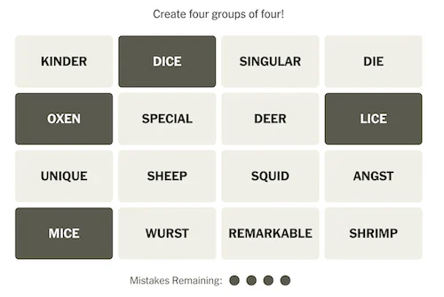
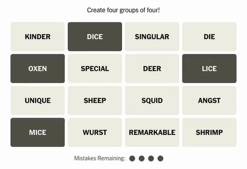
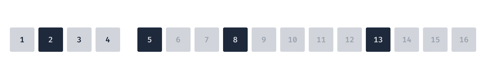
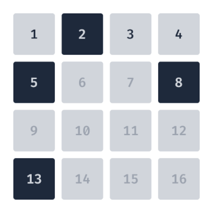
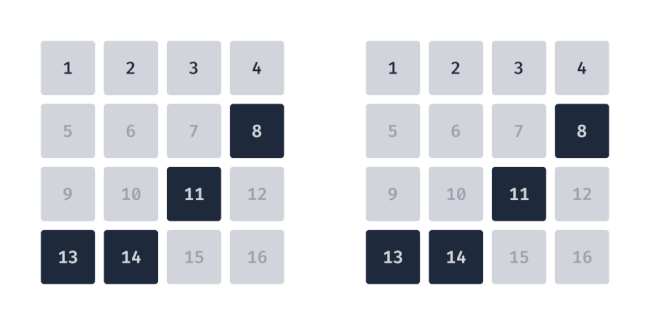
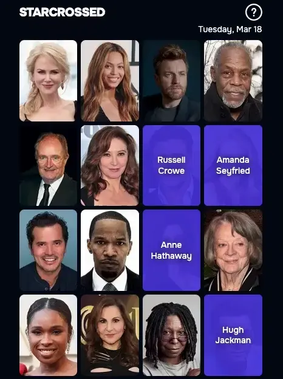

Assuming you already know how [Connections](https://www.nytimes.com/games/connections) works, given the above scenario, which tiles from the top row will swap with which correctly selected tiles when the animation happens? There are a lot of options to pair them up. Will `MICE` swap with `KINDER`, `SINGULAR` or `DIE`? Will `DICE` move, or stay put? Think about it for a second and guess, read on to see the answer.

---

These are questions I found myself asking while playing connections one day, and it came in handy when I started building [starcrossed](https://starcrossed.today). It's a daily movie puzzle game inspired by games like Connections, and one aspect of Connections I set out to emulate was the animation of the tile swaps. Learning how they worked was a vital step, and it turned out to be way more intriguing than I had expected. On that note, back to the initial prompt. Here's how the animation plays out.

We end up with the following swaps: `KINDER`↔`OXEN`, `SINGULAR`↔`LICE`, and `DIE`↔`MICE`, and `DICE` stayed put. Did you guess correctly? These pairs may seem arbitrary, but there is indeed a methodology for determining them.

## Hierarchical

Connections employs what I would call a *hierarchical* approach. To illustrate this I've recreated the grid from above with the tiles labeled 1-16, and slowed down the animation.

The four selected tiles `2` *,* `5`*,* `8`*,* and `13` need to end up in the first row. Since `2` is already in the first row, that leaves `1`*,* `3`, and `4` to swap. There are six different combinations for pairing these six tiles, and if the fourth tile also needs to be swapped then that number jumps to 24 combinations. Therefore a decision needs to be made, or a rule needs to be established to decide how the pairs are formed. In the case of Connections, the tiles are swapped based on their ordering, or hierarchy. Tiles higher up, and to the left, take precedence. Or referencing our new grid, tiles with lower numbers get paired up first. This hierarchy becomes even clearer when the tiles are arranged in a single row.

Simply move from left to right to determine the order for selecting pairs. First `1`↔`5`, then `3`↔`8`, and finally `4`↔`13`. Again, `2` stays put because it's already one of the first four tiles.

While this approach certainly makes sense, it isn't the only method to determine which tiles swap. One potential drawback of the hierarchical approach is that there may be more commotion, or a busier animation due to tiles moving farther than they need to. This brings us to the next approach.

## Nearest Neighbor

The goal here is to have the tiles move as little distance as possible, and coincidentally, overlap as little as possible. As you can see, with the same selected tiles from the previous examples, there's less movement in this animation.

In this case, it happens to be quite close to the hierarchical approach, but instead of `3`↔`8` swapping, `3`↔`13` swap because `4`↔`8` are closer together. However, in some cases the difference can be quite dramatic.

The nearest neighbor is a more subtle approach and I'm even contemplating updating starcrossed to use it. For now, starcrossed will keep its current approach, which I will call *user-driven.*

## User-Driven

If you think about it, an order has already been established before the swap occurs. We can follow the sequence in which the user selected the tiles, and then have that be the order for how the tiles should land in the top row. Below is a visualization of this approach, again using the same selected tiles as the previous examples, now assuming the user selected the tiles in a specific order: `2` → `13` → `8` → `5`*.*

Where nearest neighbor dialed back the commotion from the hierarchical approach, this can result in *more* commotion, which may be desirable! This is the approach I chose for starcrossed, with a caveat: no tiles are swapped. The tiles in the first row remain in place and are covered by the user-selected tiles.

Here's a look at this approach in action with starcrossed.

In this case, the tiles were selected in the following order:

`Hugh Jackman` → `Russell Crowe` → `Anne Hathaway` → `Amanda Seyfried`

One reason I chose this approach was to create consistency. The tiles selected by the user maintain this order as they move to the top row, and that order is maintained again when the names are listed in the revealed category (green box). I also found that by not swapping the tiles with the user-driven approach it was a happy medium in terms of animation busyness.

## Embrace the Chaos

A fourth option would be for the animation to have as much commotion as possible. Having more or less commotion isn't strictly a good or bad thing. It largely depends on the use case — perhaps more commotion is desired to evoke a feeling of high energy and excitement.

In my mind, there are essentially two ways to implement this more chaotic approach. One would be to find the opposite of the nearest neighbor (farthest neighbor), and the other would be to choose pairs at random each time the animation will run. Of course, choosing pairs at random could result in the same combination as nearest neighbor, but the randomness between each round of swaps could still evoke a feeling of novelty and excitement.

---

Each approach has it's pros and cons and choosing one ultimately depends on the experience you want to create. Whether it's the structured logic of the hierarchical method, the subtle efficiency of nearest neighbor, the personalized feel of user-driven swaps, or the lively unpredictability of a chaotic approach, each method brings something unique. For [starcrossed](https://starcrossed.today), I opted for consistency and excitement, but experimenting with different styles has been a fascinating process. If nothing else, I hope this overview has given you a new appreciation for the small details that shape how puzzles come to life on screen.